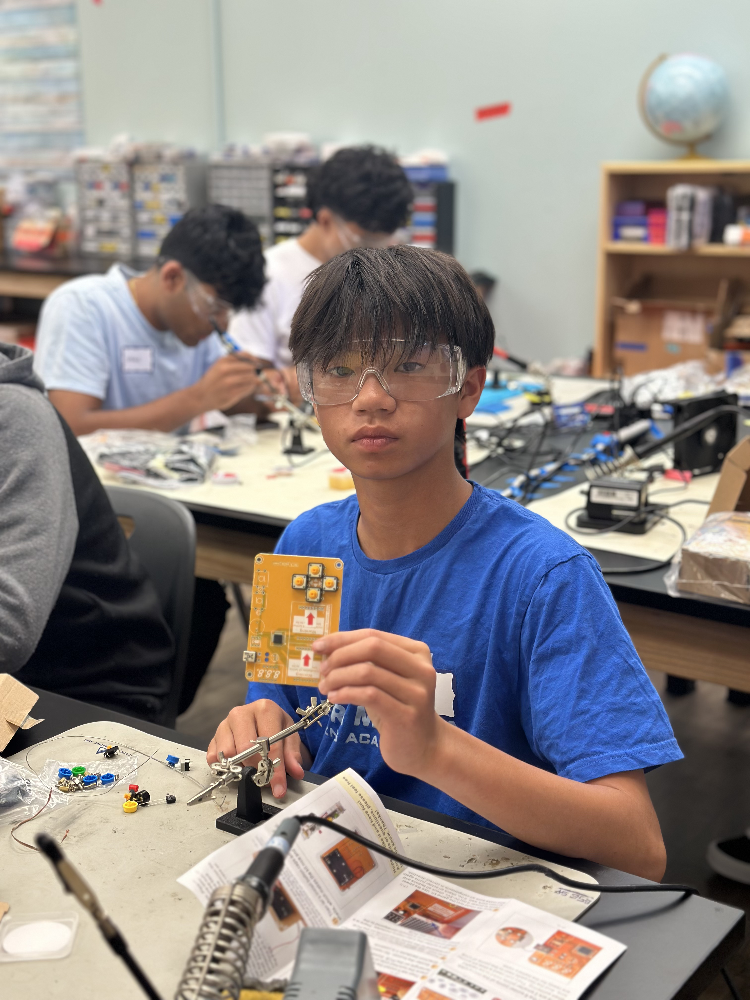

# BlueStamp Rocket Flight Test and Data Logger 🚀
When you send a rocket full of expensive components you want it to work the first time, that's where my project comes in. The purpose the rocket flight test is to validate the engineer's design while the data logger captures the exact physical readings to quantify the performance from the test. Together, the entire system is supposed to verify theoretical models to be actual models, and provide important post test info. Real full sized rocket flight testers are orders of magnitude larger than my project but the point of my project isn't to create a 1 to 1 replica of an actual rocket flight tester, it's rather a way to develop the fundamentals required for work in the same field later. Knowledge such as flight telemetery readings as well as identification of different axis are beneficial to have when going into aerospace engineering. Some of my biggest challenges include tolerances and load bearing which are both important factors in the field. Some of my biggest triumphs include getting software to work as well as finding success after long trouble shooting sessions which is present in almost any field of engineering. All in all, my project isn't just a rocket flight test and data logger, it's also a way to develop the skills required to thrive in the field of engineering.

| **Engineer** | **School** | **Area of Interest** | **Grade** |
|:--:|:--:|:--:|:--:|
| Kyler T | Monta Vista High School | Aerospace Engineering | Incoming Sophmore |



-----------------------------------------------------------------------------------------------------------------------------------------------

# Milestones 🎓

  # Final Milestone 🐔

  <iframe width="560" height="315" src="https://www.youtube.com/watch?v=PKH9MHMPW6M" title="YouTube video player" frameborder="0" allow="accelerometer; autoplay; clipboard-write; encrypted-media; gyroscope; picture-in-picture; web-share" allowfullscreen></iframe>

**Details** - My project has different components with their respective voltages, so I had to learn how to make a voltage divider. I also had to learn how to wire things properly and since I had no prior experience this was a little bit challenging.

**Progress** - I was surprised about how much I learned, so far I've learned how to solder and now I know how to create a voltage divider, how to wire things properly, how to troubleshoot things properly.

**Challenges** - A challenge I overcame was the bluetooth chip, for some reason the bluetooth chip I had didn't connect to any devices      properly so I had to install an application that forced it to connect to my laptop.

**Next Steps** - My next step from here would be to add a computer that can tell my laptop the gyroscopes current orientation because I think being able to track that would be helpful.


  # Second Milestone 🐤

<iframe width="560" height="315" src="https://youtu.be/embed/PKH9MHMPW6M?si=sbrT172EnZBECJ_M" title="YouTube video player" frameborder="0" allow="accelerometer; autoplay; clipboard-write; encrypted-media; gyroscope; picture-in-picture; web-share" allowfullscreen></iframe>

**Details** - My project has different components with their respective voltages, so I had to learn how to make a voltage divider. I also had to learn how to wire things properly and since I had no prior experience this was a little bit challenging.

**Progress** - I was surprised about how much I learned, so far I've learned how to solder and now I know how to create a voltage divider, how to wire things properly, how to troubleshoot things properly.

**Challenges** - A challenge I overcame was the bluetooth chip, for some reason the bluetooth chip I had didn't connect to any devices properly so I had to install an application that forced it to connect to my laptop.

**Next Steps** - My next step from here would be to add a computer that can tell my laptop the gyroscopes current orientation because I think being able to track that would be helpful.


  # First Milestone 🐣

<iframe width="560" height="315" src="https://youtu.be/embed/EeG8BlkBPNU?si=uci6YHmYEFvEH1bh" title="YouTube video player" frameborder="0" allow="accelerometer; autoplay; clipboard-write; encrypted-media; gyroscope; picture-in-picture; web-share" allowfullscreen></iframe>

**Details** - My project is comprised of a large wooden base, two 1x4 wood planks, four L brackets, 16 screws, 5 AA battery holder, small breadboard, Elegoo Arduino Uno R3, L298N motor driver, BO gear motor, HC-05 Bluetooth chip, five AA batteries, 1k resistor, 2k                 resistor, and jumper cables.

**Progress** - So far, I've finished the frame as in the wooden components as well as the 3d printed ones.

**Challenges** - A couple of challenges I faced durin the assembly of the frame were both during the design and the assembly phases of my project. During the design phase, on my first attempt, I had made the holes where the rods for the gyroscope sit way to shallow so they were prone to slipping out. On my second redesign I had forgotten to account for tolerance, so the two shells didn't end up clamping together correctly. On my third attempt I had the shells printed in a rough filament which didn't allow the rods to spin smoothly so on my final attempt I printed it in a smoother filament.

**Next Steps** - My plan is to finish up the electronics, then strap it to the frame which will be my second milestone.


  # Starter Milestone 🥚

<iframe width="560" height="315" src="https://www.youtube.com/embed/mfC3FOmEetY" title="YouTube video player" frameborder="0" allow="accelerometer; autoplay; clipboard-write; encrypted-media; gyroscope; picture-in-picture; web-share" allowfullscreen></iframe>

**Details** - For my starter project I decided to make the retro arcade handheld. It requires one pcb, four screws, three AA batteries, 3 AA battery holder, two digital matrix screens, one 3 digit number display, six buttons, one sound module, one power button, and 6 sheets of acrylic.

**Progress** - I've finished my starter milestone which means I need to start making a build plan as well as a parts list so I can actually start on my intensive project.

**Challenges** - During the soldering of my project, the power button became loose and fell out of it's place meaning that I had solder stuck where it wasn't supposed to be meaning I had to learn how to remove solder which was sort of difficult because it wasn't 100% affective but it got the job done.

**Next Steps** - My next step is to make the build plan as well as the parts list so that I actually start on my summer intensive project.

-----------------------------------------------------------------------------------------------------------------------------------------------


# Schematics 📝
Here's where you'll put images of your schematics. [Tinkercad](https://www.tinkercad.com/blog/official-guide-to-tinkercad-circuits) and [Fritzing](https://fritzing.org/learning/) are both great resoruces to create professional schematic diagrams, though BSE recommends Tinkercad becuase it can be done easily and for free in the browser. 

-----------------------------------------------------------------------------------------------------------------------------------------------

# Code 🧑‍💻
**This was the first attempt at getting a response from the motor which was succesful.**
 - When everything is wired up correctly, motor should spin.
 - Upload this code to the arduino to test if everything is wired up correctly.

```c++
int motorpin1 = 2;
int motorpin2 = 3;

void setup() {
  // put your setup code here, to run once:
  pinMode(motorpin1, OUTPUT);
  
  pinMode(motorpin2, OUTPUT);
}

void loop() {
  // put your main code here, to run repeatedly:
  analogWrite(motorpin1, 0);
  analogWrite(motorpin2, 255);

}
```

**This was where I tried to get the arduino to communicate with my laptop which was an important break through for this project and is crucial for the operation of this project.**
 - Goal is to get device to tell you that it recieves your commands.
 - Open up serial monitor on "Arduino IDE".
 - Set baud rate to 9600.
 - press 'F', 'B', or 'S' and it should print 'Forward', 'Backward', or 'Stop'.

```c++
void setup() {
  Serial.begin(9600);
  pinMode(LED_BUILTIN, OUTPUT);
}

void loop() {
  if (Serial.available() > 0) {
    char c = Serial.read();
    if (c == 'F') {
      Serial.println("Forward received");
      digitalWrite(LED_BUILTIN, HIGH);
    } else if (c == 'B') {
      Serial.println("Reverse received");
      digitalWrite(LED_BUILTIN, LOW);
    } else if (c == 'S') {
      Serial.println("Stop received");
    } else {
      Serial.print("Unknown: ");
      Serial.println(c);
    }
  }
}
```

**This was the final iteration of the code which combines the perameters of the first iteration and the communication of the second.**
 - This code combines the first part which is to get the motor spinning and make sure you did wiring correctly as well as the second part         where you make sure the arduino is properly responding to your device.
 - There isn't any test for this, what you do instead is you download an application called Visual Studios Code and upload the next set of        python code to it.

```c++
// Bluetooth motor control sketch
// Commands over Serial/Bluetooth:
//   F = forward
//   B = reverse
//   S = stop
//
// This example assumes an L298N-style driver:
//   IN1 -> Arduino pin 8
//   IN2 -> Arduino pin 9
//   ENA -> Arduino pin 10 (PWM)
//
// Wiring note:
//   - Connect motor driver logic pins to these Arduino pins.
//   - Connect driver GND to Arduino GND.
//   - If using a separate motor power supply, connect its GND to Arduino GND.

const int IN1 = 8;
const int IN2 = 9;
const int ENA = 10;

void setup() {
  Serial.begin(9600);
  pinMode(IN1, OUTPUT);
  pinMode(IN2, OUTPUT);
  pinMode(ENA, OUTPUT);

  digitalWrite(IN1, LOW);
  digitalWrite(IN2, LOW);
  analogWrite(ENA, 0);

  Serial.println("Bluetooth motor controller ready");
  Serial.println("Send F, B, or S");
}

void loop() {
  if (Serial.available() > 0) {
    char c = Serial.read();

    if (c == 'F' || c == 'f') {
      Serial.println("Forward");
      digitalWrite(IN1, HIGH);
      digitalWrite(IN2, LOW);
      analogWrite(ENA, 200);  // 0-255 speed
    }
    else if (c == 'B' || c == 'b') {
      Serial.println("Reverse");
      digitalWrite(IN1, LOW);
      digitalWrite(IN2, HIGH);
      analogWrite(ENA, 200);
    }
    else if (c == 'S' || c == 's') {
      Serial.println("Stop");
      digitalWrite(IN1, LOW);
      digitalWrite(IN2, LOW);
      analogWrite(ENA, 0);
    }
    else {
      Serial.print("Unknown command: ");
      Serial.println(c);
    }
  }
}
```

**This was the first attempt at getting the MPU-6050 to relay gyroscope telemetry to my laptop**
 - I was able to get it to relay it's pitch, roll, and yaw
 - It's important that it updates quickly because you need real time precise telemtery

```c++
#include <Wire.h>
#include <SoftwareSerial.h>

SoftwareSerial BT(2, 3);

const int MPU = 0x68;
const int MPU_ADDR = 0x68;
const float ACCEL_SCALE = 16384.0;  // for +/-2g
const float GYRO_SCALE = 131.0;     // for +/-250 deg/s

float pitch = 0.0;
float roll = 0.0;
float yaw = 0.0;
unsigned long lastTime = 0;
const float alpha = 0.98; // complementary filter weight

float gyroOffsetX = 0.0;
float gyroOffsetY = 0.0;
float gyroOffsetZ = 0.0;
const int CAL_SAMPLES = 500;

void setup() {
  Serial.begin(9600);
  BT.begin(9600);
  
  Wire.begin();
  Serial.begin(9600);
  BT.begin(9600);
  Wire.beginTransmission(MPU);
  Wire.write(0x68);
  Wire.write(0);
  Wire.endTransmission(true);
  delay(100);
  calibrateGyro();
  lastTime = millis();
  
  Serial.println("MPU-6050 ready");
}

void loop() {
  unsigned long currentTime = millis();
  float dt = (currentTime - lastTime) / 1000.0;
  if (dt < 0.01) {
    return;
  }
  lastTime = currentTime;

  int16_t ax, ay, az;
  int16_t gx, gy, gz;
  readMPU6050(ax, ay, az, gx, gy, gz);

  float accelX = ax / ACCEL_SCALE;
  float accelY = ay / ACCEL_SCALE;
  float accelZ = az / ACCEL_SCALE;

  float gyroX = (gx - gyroOffsetX) / GYRO_SCALE;
  float gyroY = (gy - gyroOffsetY) / GYRO_SCALE;
  float gyroZ = (gz - gyroOffsetZ) / GYRO_SCALE;

  float rollAcc = atan2(accelY, accelZ) * 180.0 / PI;
  float pitchAcc = atan2(-accelX, sqrt(accelY * accelY + accelZ * accelZ)) * 180.0 / PI;

  pitch = alpha * (pitch + gyroX * dt) + (1.0 - alpha) * pitchAcc;
  roll = alpha * (roll + gyroY * dt) + (1.0 - alpha) * rollAcc;

  if (fabs(gyroZ) > 0.5) {
    yaw += gyroZ * dt;
  }

  Serial.print("MPU: ");
  Serial.print(pitch, 2);
  Serial.print(",");
  Serial.print(roll, 2);
  Serial.print(",");
  Serial.println(yaw, 2);
}

void calibrateGyro() {
  long sumX = 0;
  long sumY = 0;
  long sumZ = 0;
  int16_t ax, ay, az;
  int16_t gx, gy, gz;

  Serial.println("Calibrating gyro, keep the board still...");
  for (int i = 0; i < CAL_SAMPLES; i++) {
    readMPU6050(ax, ay, az, gx, gy, gz);
    sumX += gx;
    sumY += gy;
    sumZ += gz;
    delay(5);
  }

  gyroOffsetX = sumX / (float)CAL_SAMPLES;
  gyroOffsetY = sumY / (float)CAL_SAMPLES;
  gyroOffsetZ = sumZ / (float)CAL_SAMPLES;

  Serial.print("Gyro offsets: ");
  Serial.print(gyroOffsetX, 2);
  Serial.print(", ");
  Serial.print(gyroOffsetY, 2);
  Serial.print(", ");
  Serial.println(gyroOffsetZ, 2);
}

void writeMPU6050(uint8_t reg, uint8_t value) {
  Wire.beginTransmission(MPU_ADDR);
  Wire.write(reg);
  Wire.write(value);
  Wire.endTransmission();
}

void readMPU6050(int16_t &ax, int16_t &ay, int16_t &az, int16_t &gx, int16_t &gy, int16_t &gz) {
  Wire.beginTransmission(MPU_ADDR);
  Wire.write(0x3B);
  Wire.endTransmission(false);
  Wire.requestFrom(MPU_ADDR, 14, true);

  ax = Wire.read() << 8 | Wire.read();
  ay = Wire.read() << 8 | Wire.read();
  az = Wire.read() << 8 | Wire.read();
  Wire.read(); Wire.read(); // temperature, ignore
  gx = Wire.read() << 8 | Wire.read();
  gy = Wire.read() << 8 | Wire.read();
  gz = Wire.read() << 8 | Wire.read();
}
```
**This was the second attempt at getting the MPU-6050 to relay telemtery to my laptop**
 - I was able to make a startup sequince to tell weather or not your MPU-6050 was working properly so if you see the startup sequence that        would tell you that you wired it up correctly
 - Additionally I also added labels for all the numbers like pitch and roll
 - I also combined this with the original keybinds from before like 'F', 'B', 'S'

```c++
#include <Wire.h>
#include <math.h>
#include <SoftwareSerial.h>

//--------------------------------
// Bluetooth
//--------------------------------
SoftwareSerial BT(2, 3);  // RX, TX

//--------------------------------
// MPU6040
//--------------------------------
const byte MPU = 0x68;

//--------------------------------
// Motor
//--------------------------------
const int IN1 = 8;
const int IN2 = 7;
const int ENA = 5;

//--------------------------------
// Function Prototypes
//--------------------------------
void processCommand(char c);
void readMPU();

void setup()
{
    Serial.begin(115200);  // Faster USB serial
    BT.begin(9600);        // Keep Bluetooth at 9600

    pinMode(IN1, OUTPUT);
    pinMode(IN2, OUTPUT);
    pinMode(ENA, OUTPUT);

    digitalWrite(IN1, LOW);
    digitalWrite(IN2, LOW);
    analogWrite(ENA, 0);

    Wire.begin();

    // Wake MPU6050
    Wire.beginTransmission(MPU);
    Wire.write(0x6B);
    Wire.write(0);
    byte error = Wire.endTransmission();

    Serial.println();
    Serial.println("===== SYSTEM START =====");

    if (error == 0)
      Serial.println("MPU6050 Connected!");
    else
    {
      Serial.print("MPU Error: ");
      Serial.println(error);
    }

    Serial.println("Ready for commands:");
    Serial.println("F = Forwawrd");
    Serial.println("B = Reverse");
    Serial.println("S = Stop");
    Serial.println("========================");
}

void loop()
{
  // USB Serial
  while (Serial.available())
  {
    processCommand(Serial.read());
  }

  // Read IMU about 100 times/second
  static unsigned long timer = 0;

  if (millis() - timer > 20)
  {
    timer = millis();
    readMPU();
  }
}

void processCommand(char c)
{
  if (c == '\n' || c == '\r')
    return;

  switch (toupper(c))
  {
    case 'F':
      Serial.println("Forward");
      BT.println("Forward");

      digitalWrite(IN1, HIGH);
      digitalWrite(IN2, LOW);
      analogWrite(ENA, 130); // 1-255 speed
      break;

    case 'B':
      Serial.println("Reverse");
      BT.println("Reverse");

      digitalWrite(IN1, LOW);
      digitalWrite(IN2, HIGH);
      analogWrite(ENA, 130);
      break;

    case 'S':
      Serial.println("Stop");
      BT.println("Stop");

      digitalWrite(IN1, LOW);
      digitalWrite(IN2, LOW);
      analogWrite(ENA, 0);
      break;

    default:
      Serial.print("Unknown: ");
      Serial.println(c);
      break;
      
  }
}

void readMPU()
{
  Wire.beginTransmission(MPU);
  Wire.write(0x3B);

  if (Wire.endTransmission(false) != 0)
    return;

  if (Wire.requestFrom(MPU, 6, true) != 6)
    return;

  int16_t ax = Wire.read() << 8 | Wire.read();
  int16_t ay = Wire.read() << 8 | Wire.read();
  int16_t az = Wire.read() << 8 | Wire.read();

  float x = ax / 16384.0;
  float y = ay / 16384.0;
  float z = az / 16384.0;

  float pitch = atan2(y, sqrt(x*x +z*z)) * 180.0 / PI;
  float roll = atan2(-x, z) * 180.0 / PI;

  Serial.print("Pitch: ");
  Serial.print(pitch, 1);

  Serial.print("°  Roll: ");
  Serial.print(roll, 1);

  Serial.println("°");
} 
```
**This was the first attempt at making a window that displays buttons which will be the main control panel.**
 - This is my first attempt at making a semi-presentable display to control the motor.
 - You can later make your own window.
 - Once you upload the code, enter 'python c:\Users\kyler\rocket_gui_v2.py' into the provided space below where it says 'PS                       C:\Users\YourName>' and a window should open.
 - If it doesn't open, ask the AI tool on  the right for assistance.

```python
import tkinter as tk
import serial
import time

arduino = serial.Serial('COM3', 9600)

time.sleep(2)

def send(command):
  arduijno.write(command.encode())

window = tk.Tk()
window.title("Motor Controller")
window.geometry("300x250")

forward = tk.button(window, text="Forward"
                    command=lambda: send("F"),
                    windth=20,height=2)

reverse = tk.Button(window,text="Reverse"
                    command=lambda: send("B")
                    windth=20,height=2)

stop = tk.button(window,text="STOP",
                 command=lambda: send("S")
                 width=20,height=2)

forward.pack(pady=10)
reverse.pack(pady=10)
stop.pack(pady=10)

window.bind("<w>",lambda e: send("F"))
window.bind("<S>",lambda e: send("B"))
window.bind("<space>",lambda e: send("S"))

window.mainloop(
```

**This was the second attempt at making a window that displays button. I tried to work on the asthetics of the window which in my opinion looks great.**
 - I changed the asthetics of the window a little bit to my preferences but again, you can change it to what you like.
 - Once you open the window, you have to connect your arduino to the right COM port, for me it was COM port 12 but it might be different for      you.
 - Then you should be able to control the motor, you can adjust the speed of the motor as you'd like.

```Python
import tkinter as tk
from tkinter import ttk, scrolledtext, messagebox
import threading
import queue
import time
import serial
from serial.tools import list_ports


class SerialGUI:
    def __init__(self, root):
        self.root = root
        root.title("Rocket Controller — Bluetooth")
        root.attributes('-fullscreen', True)
        root.configure(bg='#0f0f0f')
        root.resizable(False, False)
        # Escape to exit fullscreen
        root.bind('<Escape>', lambda e: self._exit_fullscreen())

        self.serial = None
        self.read_thread = None
        self.read_q = queue.Queue()
        self.stop_event = threading.Event()

        self.bg_canvas = tk.Canvas(self.root, bg='#0f0f0f', highlightthickness=0)
        self.bg_canvas.place(x=0, y=0, relwidth=1, relheight=1)
        self.root.bind('<Configure>', lambda e: self._draw_grid())
        self.root.after(50, self._draw_grid)

        self._build_ui()
        self._poll_serial()

    def _draw_grid(self):
        self.bg_canvas.delete('all')
        width = max(1, self.root.winfo_width())
        height = max(1, self.root.winfo_height())
        spacing = 96
        color = '#2a2a2a'
        frame_color = '#4d4d4d'

        for x in range(0, width + 1, spacing):
            self.bg_canvas.create_line(x, 0, x, height, fill=color, width=1)
        for y in range(0, height + 1, spacing):
            self.bg_canvas.create_line(0, y, width, y, fill=color, width=1)

        pad_x = 140
        pad_y = 120
        self.bg_canvas.create_rectangle(pad_x, pad_y, width - pad_x, height - pad_y, outline=frame_color, width=2)
        self.bg_canvas.create_rectangle(pad_x + 24, pad_y + 24, width - pad_x - 24, height - pad_y - 24, outline=frame_color, width=1)

    def _build_ui(self):
        # configure ttk styles for dark theme
        style = ttk.Style()
        try:
            style.theme_use('clam')
        except Exception:
            pass
        style.configure('TFrame', background='#0f0f0f')
        style.configure('TLabel', background='#0f0f0f', foreground='#f2f2f2')
        style.configure('TButton', background='#2a2a2a', foreground='#f2f2f2', font=('Segoe UI', 11, 'bold'))
        style.configure('TCombobox', fieldbackground='#161616', background='#2a2a2a', foreground='#f2f2f2')
        style.configure('TEntry', fieldbackground='#161616', foreground='#f2f2f2')

        self.status_var = tk.StringVar(value="Disconnected")
        ttk.Label(self.root, textvariable=self.status_var, foreground='#d9d9d9', background='#0f0f0f').pack(anchor="w", padx=12)

        # top area with three large colored buttons (upper half)
        top_area = tk.Frame(self.root, bg='#0f0f0f')
        top_area.pack(fill='both', expand=True)

        title_label = tk.Label(top_area, text='Controls', bg='#0f0f0f', fg='#f2f2f2', font=('Segoe UI', 30, 'bold'))
        title_label.pack(pady=(24, 10))

        center_frame = tk.Frame(top_area, bg='#0f0f0f')
        center_frame.place(relx=0.5, rely=0.25, anchor='n')

        btn_font = ("Segoe UI", 30, "bold")
        self.forward_btn = tk.Button(center_frame, text="Forward\n(F)", command=lambda: self.send_cmd('F'), bg='#1f1f1f', fg='#f2f2f2', activebackground='#3a3a3a', font=btn_font, width=14, height=3, relief='raised', bd=3)
        self.forward_btn.grid(row=0, column=0, padx=20, pady=10)

        self.reverse_btn = tk.Button(center_frame, text="Reverse\n(B)", command=lambda: self.send_cmd('B'), bg='#2b2b2b', fg='#f2f2f2', activebackground='#4a4a4a', font=btn_font, width=14, height=3, relief='raised', bd=3)
        self.reverse_btn.grid(row=0, column=1, padx=20, pady=10)

        self.stop_btn = tk.Button(center_frame, text="Stop\n(S)", command=lambda: self.send_cmd('S'), bg='#3b3b3b', fg='#f2f2f2', activebackground='#5a5a5a', font=btn_font, width=14, height=3, relief='raised', bd=3)
        self.stop_btn.grid(row=0, column=2, padx=18, pady=8)

        # small log area just above bottom controls
        self.log = scrolledtext.ScrolledText(self.root, height=6, state='disabled', wrap='word', bg='#161616', fg='#e6e6e6', insertbackground='#e6e6e6')
        self.log.pack(fill='x', padx=12, pady=(0,6))

        # bottom controls centered
        bottom_frame = tk.Frame(self.root, bg='#0f0f0f')
        bottom_frame.pack(side='bottom', fill='x', pady=24)

        controls = tk.Frame(bottom_frame, bg='#0f0f0f')
        controls.pack(anchor='center')

        self.port_var = tk.StringVar()
        ttk.Label(controls, text="Port:", style='TLabel').grid(row=0, column=0, sticky='e', padx=(0,6))
        self.port_combo = ttk.Combobox(controls, textvariable=self.port_var, width=18, state="readonly")
        self.port_combo['values'] = self._available_ports()
        self.port_combo.grid(row=0, column=1, padx=(0,12))

        ttk.Button(controls, text="Refresh", command=self._refresh_ports).grid(row=0, column=2, padx=(0,12))

        self.connect_btn = ttk.Button(controls, text="Connect", command=self.toggle_connect)
        self.connect_btn.grid(row=0, column=3, padx=(12,0))

        # key bindings
        self.root.bind('<f>', lambda e: self.send_cmd('F'))
        self.root.bind('<F>', lambda e: self.send_cmd('F'))
        self.root.bind('<b>', lambda e: self.send_cmd('B'))
        self.root.bind('<B>', lambda e: self.send_cmd('B'))
        self.root.bind('<s>', lambda e: self.send_cmd('S'))
        self.root.bind('<S>', lambda e: self.send_cmd('S'))
 
    def _exit_fullscreen(self):
        try:
            self.root.attributes('-fullscreen', False)
            self.root.geometry('1200x800')
        except Exception:
            pass

    def _available_ports(self):
        return [p.device for p in list_ports.comports()]

    def _refresh_ports(self):
        vals = self._available_ports()
        self.port_combo['values'] = vals
        if vals:
            self.port_combo.set(vals[0])
        self._log(f"Ports: {vals}")

    def toggle_connect(self):
        if self.serial and self.serial.is_open:
            self._disconnect()
        else:
            self._connect()

    def _connect(self):
        port = self.port_var.get() or (self._available_ports()[0] if self._available_ports() else None)
        if not port:
            messagebox.showwarning("No port", "No serial ports found. Connect your HC-05 and hit Refresh.")
            return
        baud = 9600
        try:
            self.serial = serial.Serial(port, baud, timeout=0.5, writeTimeout=0.5)
            self.status_var.set(f"Connected {port}@{baud}")
            self._log(f"Opened {port} @ {baud}")
            self.connect_btn.config(text='Disconnect')
            # start reader thread
            self.stop_event.clear()
            self.read_thread = threading.Thread(target=self._reader, daemon=True)
            self.read_thread.start()
        except Exception as e:
            messagebox.showerror("Connect failed", str(e))
            self._log(f"Connect error: {e}")

    def _disconnect(self):
        self.stop_event.set()
        if self.read_thread:
            self.read_thread.join(timeout=1)
        if self.serial:
            try:
                self.serial.close()
                self._log("Serial closed")
            except Exception:
                pass
        self.serial = None
        self.connect_btn.config(text='Connect')
        self.status_var.set("Disconnected")

    def _reader(self):
        while not self.stop_event.is_set():
            try:
                if self.serial and self.serial.in_waiting:
                    data = self.serial.readline().decode(errors='ignore').strip()
                    if data:
                        self.read_q.put(f"RX: {data}")
                else:
                    time.sleep(0.05)
            except Exception as e:
                self.read_q.put(f"Read error: {e}")
                break

    def _poll_serial(self):
        while not self.read_q.empty():
            line = self.read_q.get()
            self._log(line)
        self.root.after(100, self._poll_serial)

    def _log(self, text):
        self.log.configure(state='normal')
        self.log.insert('end', f"[{time.strftime('%H:%M:%S')}] {text}\n")
        self.log.see('end')
        self.log.configure(state='disabled')

    def send_cmd(self, cmd):
        if not self.serial or not self.serial.is_open:
            self._log("Serial not open — cannot send")
            return
        try:
            self.serial.write(cmd.encode())
            self.serial.flush()
            self._log(f"TX: {cmd} (button)")
        except Exception as e:
            self._log(f"Send error: {e}")

    def _manual_send(self):
        txt = self.manual_var.get()
        if not txt:
            return
        self.send_cmd(txt)


if __name__ == '__main__':
    root = tk.Tk()
    app = SerialGUI(root)
    root.mainloop()

```

-----------------------------------------------------------------------------------------------------------------------------------------------

# Bill of Materials 💲

| **Part** | **Note** | **Price** | **Link** |
|:--:|:--:|:--:|:--:|
| Elagoo Arduino Uno | Program Motor | $16.99 | <a href="https://amzn.to/4vxjrlB"> Link </a> |
| L298N Motor Driver | Control Motor | $4.99 | <a href="https://amzn.to/4fnQbYC"> Link </a> |
| Small Breadboard | Allow you to wire up bluetooth controller | $6.99 | <a href="https://amzn.to/4yB9wye"> Link </a> |
| Hc-05 Bluetooth Module | Allow you to control motor through device | $9.99 | <a href="https://amzn.to/44tP0Sm"> Link </a> |
| Male to Male Jumper Cables | Wire Circutery | $3.99 | <a href="https://tinyurl.com/4s3233e7"> Link </a> |
| Male to Female Jumper Cables | Wire Circutery | $3.99 | <a href="https://tinyurl.com/4kjvuzkk"> Link </a> |
| 5 AA Battery Holder | Provide Power to Circut | $3.95 | <a href="https://tinyurl.com/4funwr9z"> Link </a> |
| Gear Motor | Drive Gears on Gyroscope | $6.89 | <a href="https://tinyurl.com/2p9shaxn"> Link </a> |
| L Brackets | Hold up Wood Planks | $6.99 | <a href="https://tinyurl.com/47z2rzwa"> Link </a> |
| Wood Base | Secure Entire Project | $21.59 | <a href="https://tinyurl.com/2p9t392b"> Link </a> |
| Wood Planks | Hold up Entire Project | $11.99 | <a href="https://tinyurl.com/mtpm7kcm"> Link </a> |
| AA Batteries | Provide Power | $12.49 | <a href="https://tinyurl.com/2p9veynu"> Link </a> |
| **Total** | Total Amount of Money for Project | $106.85 |

-----------------------------------------------------------------------------------------------------------------------------------------------

# Other Resources/Examples 🧐
- [Python & C++ Tutorial](https://drive.google.com/file/d/1y6tHtg-YjrS1z1dv9hwAJJ9f_WMo-Jii/view)
- [CAD Tutorial](https://www.youtube.com/watch?v=bzePWxAdiI4)
- [Arduino IDE Tutorial](https://www.youtube.com/watch?v=S9MLbEeDjEE)
